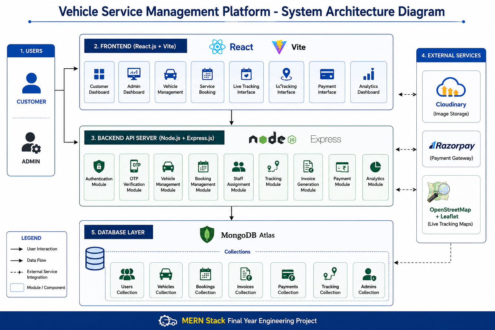
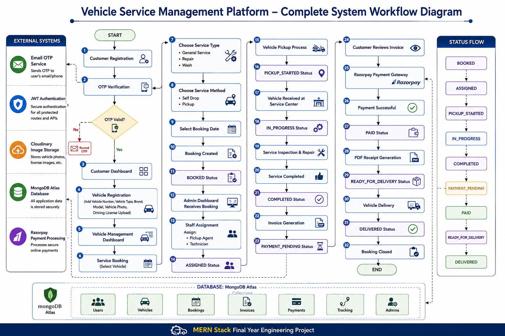

Vehicle Service Management and Operations Platform

A full-stack MERN application that automates vehicle service operations through OTP authentication, vehicle registration, service booking, real-time tracking, invoice generation, Razorpay payment integration, and administrative management dashboards.

Overview

Vehicle Service Management and Operations Platform is a comprehensive web-based solution designed to streamline vehicle maintenance workflows for customers and service centers.

The platform enables customers to register vehicles, schedule service appointments, track service progress in real time, make secure online payments, and download digital invoices. Administrators can manage bookings, assign staff, monitor service operations, track payments, and analyze business performance through centralized dashboards.

This project was developed as a Final Year Bachelor of Engineering Project using the MERN Stack.

Key Features
Customer Module
OTP-based user authentication
Vehicle registration and management
Driving license and vehicle image uploads
Service booking with date validation
Pickup and self-drop service options
Real-time vehicle tracking
Razorpay payment integration
PDF invoice and receipt generation
Booking history and service status tracking
Admin Module
Secure admin authentication
Booking management dashboard
Staff assignment and service allocation
Invoice generation system
Payment monitoring and revenue tracking
Customer management
Analytics dashboard for service operations
Technology Stack
Frontend
React.js
Vite
Tailwind CSS
Axios
Backend
Node.js
Express.js
Database
MongoDB Atlas
Authentication & Security
JWT Authentication
OTP Verification
Cloud & Storage
Cloudinary
Payment Gateway
Razorpay
Maps & Tracking
Leaflet
OpenStreetMap
Other Tools
jsPDF
Multer
System Architecture Diagram

High-level architecture of the Vehicle Service Management Platform showing interactions between users, React frontend modules, Express backend services, external integrations, and MongoDB Atlas.


System Workflow Diagram

The complete end-to-end workflow of the Vehicle Service Management Platform, illustrating customer registration, vehicle onboarding, service booking, staff assignment, service lifecycle tracking, invoice generation, Razorpay payment processing, PDF receipt generation, and vehicle delivery management.



## Project Structure
VehicleServiceManagement/
│
├── client/
│   ├── public/
│   ├── src/
│   │   ├── adminComponents/
│   │   ├── adminLayout/
│   │   ├── adminPages/
│   │   ├── assets/
│   │   ├── components/
│   │   ├── pages/
│   │   ├── App.jsx
│   │   ├── App.css
│   │   ├── index.css
│   │   └── main.jsx
│   │
│   ├── index.html
│   ├── package.json
│   ├── vite.config.js
│   ├── tailwind.config.js
│   └── postcss.config.js
│
├── server/
│   ├── config/
│   ├── constants/
│   ├── controllers/
│   ├── middleware/
│   ├── models/
│   ├── routes/
│   ├── seeders/
│   ├── services/
│   ├── uploads/
│   ├── utils/
│   ├── server.js
│   └── package.json
│
├── ai-services/
│
├── docs/
│   ├── System_Architecture_Diagram.png
│   ├── System_Workflow_Diagram.png
│   ├── Project Screenshots
│   └── Documentation Assets
│
├── .gitignore
└── README.md
```
Service Lifecycle Status Flow
BOOKED
↓
ASSIGNED
↓
PICKUP_STARTED
↓
IN_PROGRESS
↓
COMPLETED
↓
PAYMENT_PENDING
↓
PAID
↓
READY_FOR_DELIVERY
↓
DELIVERED
Screenshots
User Registration & OTP Authentication

Customer Dashboard & Vehicle Registration

Vehicle Management Dashboard

Service Booking Interface

Booking Confirmation & Service Tracking Dashboard

Customer Booking Status & Payment Pending View

Real-Time Vehicle Tracking System

Booking Management & Staff Assignment

Invoice Generation & Billing Management

Customer Invoice & Payment Summary

Razorpay Payment Gateway Integration

Successful Online Payment Transaction

Payment Success & Receipt Download Portal

PDF Receipt Generation System

Admin OTP Authentication Portal

Admin Dashboard Overview & Service Analytics

Admin Payment Management Dashboard

Service Analytics & Business Insights Dashboard

User Management & Role Administration

Project Highlights
Designed and developed a complete end-to-end vehicle service management platform using the MERN stack.
Implemented OTP-based authentication and JWT authorization.
Integrated Razorpay payment gateway for secure online transactions.
Developed real-time vehicle tracking using Leaflet and OpenStreetMap.
Automated invoice generation and PDF receipt downloads.
Implemented Cloudinary-based image storage for vehicle and document uploads.
Built administrative dashboards for booking, payment, customer, and analytics management.
Implemented service lifecycle tracking from booking to vehicle delivery.
Future Enhancements
AI-powered service recommendations
Predictive vehicle maintenance alerts
SMS and WhatsApp notifications
Mobile application support
Multi-service-center management
Advanced reporting and analytics
Author

Monish Gowda S R

Bachelor of Engineering – Information Science & Engineering
MVJ College of Engineering, Bengaluru

GitHub: MonishGowdaSR
